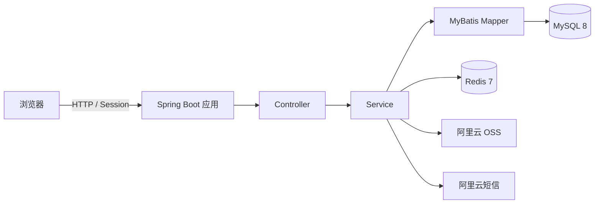

# 羽悦羽毛球场地预约系统

面向校内师生的羽毛球场地预约与运营管理系统。项目提供场地预约、预约核销、活动报名、论坛交流和后台管理等功能，前后端由同一个 Spring Boot 应用提供服务，并支持通过 Docker Compose 一键部署。


## 功能特性

### 用户端

- 手机号验证码注册、密码登录和会话认证
- 查看未来三天的场地及时间段余量
- 创建、取消和查询个人预约
- 预约核销码查询及二维码展示
- 活动浏览、报名和对阵信息展示
- 个人资料、手机号和头像维护
- 论坛发帖、图片上传、回复、删除和举报
- 帖子分类、关键词检索和分页浏览

### 管理端

- 场地新增、编辑、锁定、维护和逻辑删除
- 预约查询、详情查看和核销
- 活动新增、编辑、删除及图片上传
- 活动报名名单查询和 Excel 导出
- 用户查询、详情查看和账号状态管理
- 论坛帖子置顶、内容隐藏及举报处理
- 预约状态自动流转和操作日志记录

## 技术栈

| 类别 | 技术 |
| --- | --- |
| 后端 | Spring Boot 2.7.18、Java 11、Spring MVC、Bean Validation |
| 数据访问 | MyBatis 2.3.1、PageHelper 1.4.7、MySQL 8.0 |
| 缓存 | Redis 7、Lettuce |
| 认证与安全 | HttpSession、拦截器、BCrypt |
| 文件与短信 | 阿里云 OSS、阿里云号码认证服务 |
| Excel | Apache POI 4.1.2 |
| 前端 | HTML、CSS、原生 JavaScript |
| 构建与部署 | Maven、Docker、Docker Compose |
| 测试 | JUnit 5、Mockito、Spring Boot Test |

## 系统架构



## 快速开始

### 方式一：Docker Compose（推荐）

#### 环境要求

- Docker Engine 20.10+
- Docker Compose v2

#### 1. 克隆项目

```bash
git clone https://github.com/helloiworld929/badminton-reservation.git
cd badminton-reservation
```

#### 2. 配置环境变量

复制环境变量模板：

```bash
cp .env.example .env
```

Windows PowerShell：

```powershell
Copy-Item .env.example .env
```

编辑 `.env`，至少填写以下配置：

```dotenv
MYSQL_ROOT_PASSWORD=请设置高强度数据库密码
ALIBABA_CLOUD_ACCESS_KEY_ID=你的AccessKeyId
ALIBABA_CLOUD_ACCESS_KEY_SECRET=你的AccessKeySecret
```

`.env` 已被 Git 忽略，不要把真实密码或 AccessKey 提交到仓库。

#### 3. 启动服务

```bash
docker compose config
docker compose up -d --build
docker compose ps
```

容器全部健康后访问：

- 登录页面：<http://localhost:8080/login.html>
- 用户首页：<http://localhost:8080/index.html>
- 管理后台：<http://localhost:8080/admin.html>
- 宿主机 MySQL：`localhost:3307`

查看应用日志：

```bash
docker compose logs -f app
```

停止服务：

```bash
docker compose down
```

普通的 `docker compose down` 不会删除数据库。不要在有业务数据时执行 `docker compose down -v`。

### 方式二：本地运行

#### 环境要求

- JDK 11
- Maven 3.8+
- MySQL 8.0
- Redis 6+

#### 1. 初始化数据库

确认本地 MySQL 已启动，然后执行：

```bash
mysql -u root -p -e "source src/main/resources/schema.sql"
```

> `schema.sql` 会删除并重建业务表，仅应对全新数据库执行，不要用它升级已有生产数据库。

#### 2. 设置环境变量

Linux/macOS：

```bash
export MYSQL_HOST=localhost
export MYSQL_PORT=3306
export MYSQL_USER=root
export MYSQL_PASSWORD='你的数据库密码'
export REDIS_HOST=localhost
export REDIS_PORT=6379
export ALIBABA_CLOUD_ACCESS_KEY_ID='你的AccessKeyId'
export ALIBABA_CLOUD_ACCESS_KEY_SECRET='你的AccessKeySecret'
```

Windows PowerShell：

```powershell
$env:MYSQL_HOST = 'localhost'
$env:MYSQL_PORT = '3306'
$env:MYSQL_USER = 'root'
$env:MYSQL_PASSWORD = '你的数据库密码'
$env:REDIS_HOST = 'localhost'
$env:REDIS_PORT = '6379'
$env:ALIBABA_CLOUD_ACCESS_KEY_ID = '你的AccessKeyId'
$env:ALIBABA_CLOUD_ACCESS_KEY_SECRET = '你的AccessKeySecret'
```

#### 3. 启动应用

```bash
mvn spring-boot:run
```

也可以先打包再运行：

```bash
mvn clean package
java -jar target/badminton.jar
```

应用默认监听 `8080` 端口。

## 创建管理员

初始化脚本不会创建默认账号。先在登录页面注册一个普通用户，再进入 MySQL：

```bash
docker exec -it badminton-mysql mysql -uroot -p
```

将指定手机号对应的用户设置为管理员：

```sql
UPDATE badminton.users
SET role = 'admin'
WHERE phone = '请替换为已注册手机号';
```

退出当前账号并重新登录后，即可访问管理后台。不要在公开仓库中写入真实手机号或默认管理员密码。

## 页面入口

| 页面 | 地址 | 权限 |
| --- | --- | --- |
| 登录与注册 | `/login.html` | 公开 |
| 用户首页 | `/index.html` | 登录用户 |
| 场地预约 | `/reservation.html` | 登录用户 |
| 预约记录 | `/record.html` | 登录用户 |
| 活动列表 | `/activity.html` | 登录用户 |
| 论坛讨论 | `/forum.html` | 登录用户 |
| 个人信息 | `/info.html` | 登录用户 |
| 管理后台 | `/admin.html` | 管理员 |

## 主要接口

所有业务接口统一返回 `ApiResponse` JSON 结构。除登录、注册及静态资源外，其余接口需要有效的登录会话；`/admin/**` 仅允许 `admin` 角色访问。

| 模块 | 接口前缀 | 说明 |
| --- | --- | --- |
| 认证 | `/login`、`/logout` | 登录和退出 |
| 注册 | `/register` | 验证码、注册和头像上传 |
| 用户 | `/user` | 个人资料查询与修改 |
| 预约 | `/reserve`、`/reservations` | 场地余量、预约、取消和核销码 |
| 活动 | `/activities`、`/activity-signups` | 活动浏览和报名 |
| 论坛 | `/forum` | 帖子、回复和举报 |
| 管理端 | `/admin` | 场地、预约、活动、用户和论坛管理 |

## 预约规则

默认预约规则配置在 `src/main/resources/application.yml`：

- 每次只能预约 1 小时
- 可预约今天、明天或后天
- 每个场地同一时间段最多 4 人
- 每位用户每天最多预约 2 次
- 每位用户最多同时持有 4 个未核销预约
- 默认可预约时间为 `08:00` 至 `20:00`
- 预约开始前 15 分钟起可以核销
- 超过预约开始时间 30 分钟未核销会标记为爽约
- 受限账号不能创建预约

可通过 `app.reservation` 下的配置项调整人数、时间范围、核销时间和每日开放时间。

## 数据库与持久化

数据库结构位于 `src/main/resources/schema.sql`，包含以下数据表：

- 用户、场地、预约及预约操作日志
- 活动和活动报名
- 论坛帖子、图片、回复和举报

Docker Compose 使用命名卷持久化 MySQL 和 Redis 数据：

```yaml
volumes:
  mysql-data:
  redis-data:
```

MySQL 数据写入 `/var/lib/mysql`，容器重建后仍会保留。`schema.sql` 只会在 MySQL 数据卷第一次初始化时自动执行。

### 备份数据库

PowerShell：

```powershell
docker exec badminton-mysql sh -c 'exec mysqldump -uroot -p"$MYSQL_ROOT_PASSWORD" --single-transaction --routines --triggers badminton' > badminton-backup.sql
```

### 恢复数据库

PowerShell：

```powershell
Get-Content -Raw .\badminton-backup.sql | docker exec -i badminton-mysql sh -c 'exec mysql -uroot -p"$MYSQL_ROOT_PASSWORD" badminton'
```

生产环境应将备份保存到 Docker 主机以外的位置，并定期验证恢复流程。

## 配置说明

| 环境变量 | 必填 | 默认值 | 说明 |
| --- | --- | --- | --- |
| `MYSQL_ROOT_PASSWORD` | Docker 必填 | 无 | Compose 中 MySQL root 密码 |
| `MYSQL_HOST` | 否 | `localhost` | MySQL 地址；容器内为 `mysql` |
| `MYSQL_PORT` | 否 | `3306` | MySQL 端口 |
| `MYSQL_USER` | 否 | `root` | MySQL 用户名 |
| `MYSQL_PASSWORD` | 本地运行必填 | 无 | 应用连接 MySQL 的密码 |
| `REDIS_HOST` | 否 | `localhost` | Redis 地址；容器内为 `redis` |
| `REDIS_PORT` | 否 | `6379` | Redis 端口 |
| `REDIS_PASSWORD` | 否 | 空 | Redis 密码 |
| `ALIBABA_CLOUD_ACCESS_KEY_ID` | 是 | 无 | OSS 与短信服务凭据 |
| `ALIBABA_CLOUD_ACCESS_KEY_SECRET` | 是 | 无 | OSS 与短信服务凭据 |

阿里云 OSS 的 Endpoint、Bucket、短信签名和模板目前配置在 `application.yml`。部署前应替换为自己的资源配置，并为 AccessKey 授予最小必要权限。

## 项目结构

```text
badminton-reservation/
├── src/main/java/com/badminton/
│   ├── common/             # 通用响应、业务异常和全局异常处理
│   ├── config/             # Web、Redis、认证、安全和业务配置
│   ├── controller/         # 用户端与管理端接口
│   ├── dto/                # 请求和响应对象
│   ├── entity/             # 数据库实体
│   ├── mapper/             # MyBatis Mapper 接口
│   └── service/            # 预约、活动、论坛及外部服务逻辑
├── src/main/resources/
│   ├── mapper/             # MyBatis XML 映射
│   ├── static/             # HTML、CSS 和 JavaScript 页面
│   ├── application.yml     # 应用配置
│   └── schema.sql          # 全新数据库初始化脚本
├── src/test/               # 单元测试和控制器测试
├── Dockerfile              # 应用镜像构建文件
├── docker-compose.yml      # 应用、MySQL 和 Redis 编排
├── .env.example            # 环境变量模板
└── pom.xml                 # Maven 配置
```

## 测试

运行全部测试：

```bash
mvn test
```

运行完整构建：

```bash
mvn clean package
```

当前测试主要覆盖预约规则与状态流转、活动管理与 Excel 导出、论坛业务规则，以及部分管理端权限和删除行为。测试环境不连接真实的 MySQL、Redis、OSS 或短信服务。

## 安全与部署建议

- 不要提交 `.env`、数据库密码、AccessKey、手机号或生产地址
- 生产环境通过服务器权限受控的环境文件或密钥管理服务注入凭据
- 对外部署时使用 Nginx/Caddy 提供 HTTPS，并限制 MySQL 和 Redis 端口暴露
- 定期备份数据库，并在独立环境验证备份可恢复
- 轮换已泄露的凭据；仅从后续提交中删除并不能消除泄露风险
- 升级已有数据库时使用增量迁移脚本，不要重新执行会删表的完整 `schema.sql`

## 许可证

本仓库目前未提供开源许可证。未经仓库所有者明确授权，不应将代码视为可自由复制、修改或分发的软件。
